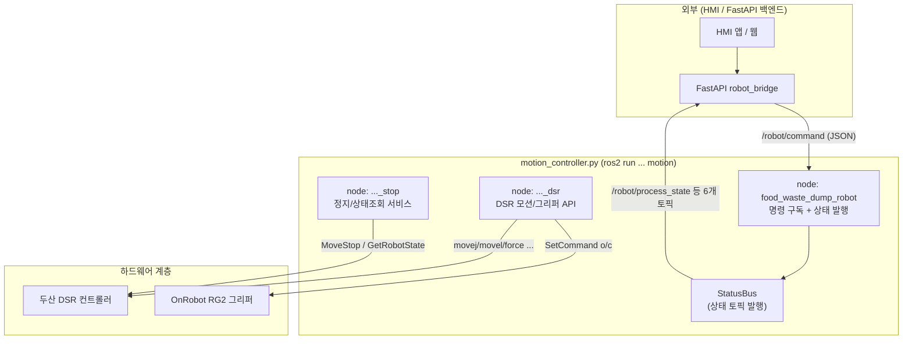
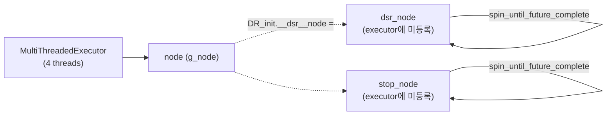
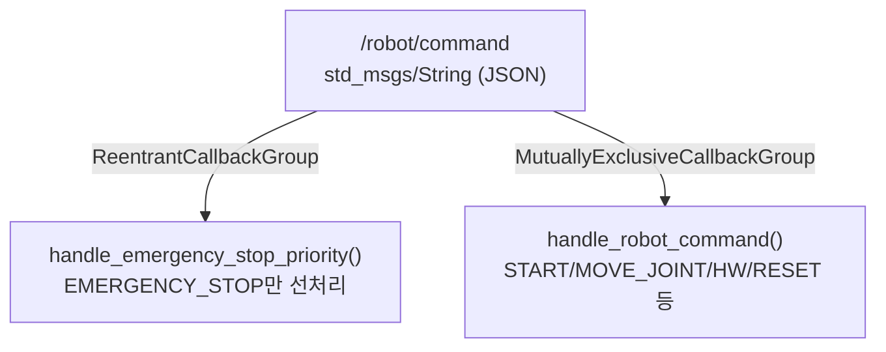
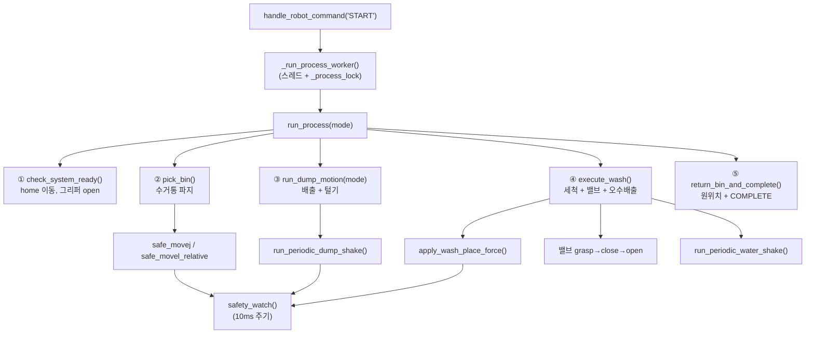
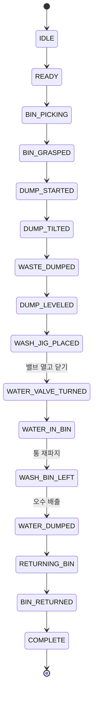
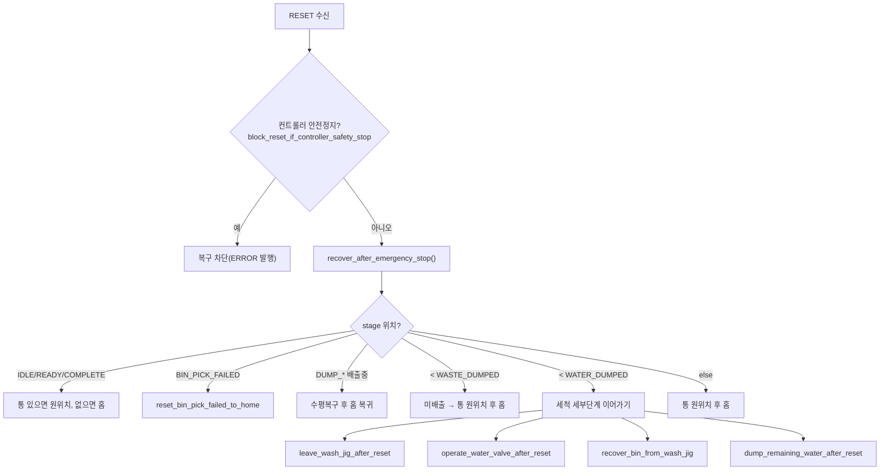
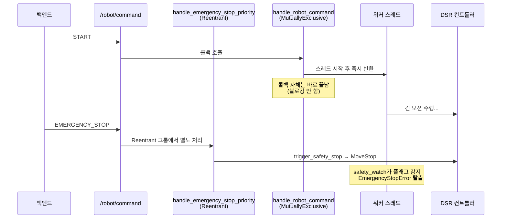
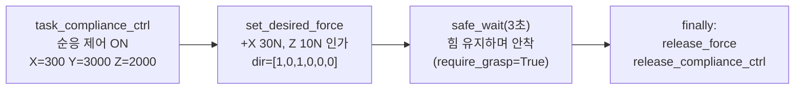
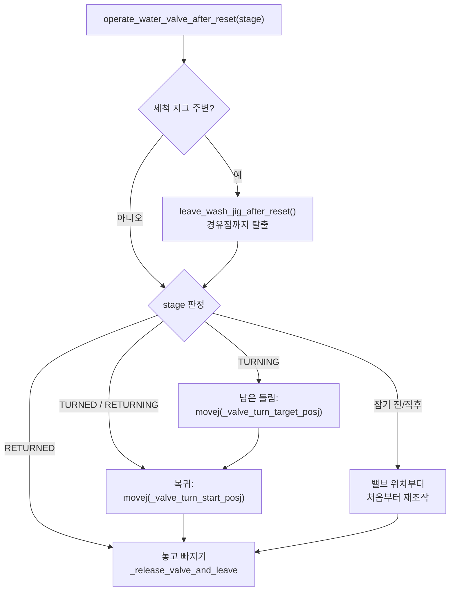

# `motion_controller.py` 구조 분석 문서

> 대상 파일: [`auto_dump_robot_pkg/motion_controller.py`](../auto_dump_robot_pkg/motion_controller.py) (1646줄)
> 로봇: 두산 협동로봇 **M0609** (`dsr01`) + OnRobot **RG2** 그리퍼
> 역할: 음식물 수거통 **자동 배출 → 세척 → 오수 배출 → 원위치 복귀** 공정 제어 및 안전/복구

이 문서는 코드를 4개 관점(노드 → 통신 → 함수 호출 → 상태머신)으로 분해하고,
설계상 가장 까다로운 3개 부분(**콜백 그룹 / 힘제어 안착 / 밸브 복구**)을 심화 분석합니다.

다이어그램은 두 형태로 제공합니다.
- 본문 내 **Mermaid** 블록 (VSCode·GitHub에서 바로 렌더링)
- [`diagrams/`](./diagrams/) 폴더의 **PNG** (graphviz 렌더링 결과)

---

## 목차
1. [전체 아키텍처](#1-전체-아키텍처)
2. [ROS2 노드 구조 (3개로 분리한 이유)](#2-ros2-노드-구조-3개로-분리한-이유)
3. [통신 구조 (Topic / Service)](#3-통신-구조-topic--service)
4. [함수 호출 트리 (정상 공정)](#4-함수-호출-트리-정상-공정)
5. [상태머신 (ProcessState / RecoveryStage)](#5-상태머신-processstate--recoverystage)
6. [심화① 콜백 그룹 동작](#6-심화-콜백-그룹-동작-비상정지-우선순위)
7. [심화② 힘제어 안착 (apply_wash_place_force)](#7-심화-힘제어-안착-apply_wash_place_force)
8. [심화③ 밸브 복구 로직](#8-심화-밸브-복구-로직)
9. [부록: 전역 상태/락 정리](#9-부록-전역-상태--락-정리)

---

## 1. 전체 아키텍처



PNG: [`diagrams/01_architecture.png`](./diagrams/01_architecture.png)

---

## 2. ROS2 노드 구조 (3개로 분리한 이유)

[`main()`](../auto_dump_robot_pkg/motion_controller.py#L1582)은 **단일 프로세스 안에서 노드 3개**를 생성합니다.
이것이 이 코드의 가장 중요한 설계 결정입니다.

| 노드 | 변수 | 역할 | 누가 spin? |
|------|------|------|------------|
| `food_waste_dump_robot` | `node` / `g_node` | `/robot/command` 구독, 상태 토픽 발행 | `MultiThreadedExecutor` (메인) |
| `food_waste_dump_robot_dsr` | `dsr_node` | DSR_ROBOT2 API·그리퍼 서비스 호출 | API가 직접 `spin_until_future_complete` |
| `food_waste_dump_robot_stop` | `stop_node` | `MoveStop`·`GetRobotState` 정지/상태조회 | 자체 `spin_until_future_complete` |

**왜 나눴는가?**
- DSR API(`movej` 등)는 내부적으로 `dsr_node`를 직접 spin합니다. 이 노드를 executor에 또 넣으면 **이중 spin 충돌**이 납니다 → 그래서 `dsr_node`는 executor에 등록하지 않습니다.
- 정지(`MoveStop`)는 모션이 진행 중인(=dsr_node가 바쁜) 순간에 호출되어야 하므로 **별도 `stop_node`** 로 분리해 충돌을 피합니다.
- 명령 구독 노드만 `MultiThreadedExecutor(num_threads=4)`로 돌려, **공정이 한 스레드를 점유해도 비상정지가 다른 스레드에서 즉시 처리**되게 합니다.



---

## 3. 통신 구조 (Topic / Service)

### 3.1 구독 — 같은 토픽을 콜백 2개로

`/robot/command` 하나를 **서로 다른 콜백 그룹**으로 두 번 구독합니다. (자세한 내용 [심화①](#6-심화-콜백-그룹-동작-비상정지-우선순위))



### 3.2 발행 — [`StatusBus`](../auto_dump_robot_pkg/motion_controller.py#L394) 클래스가 전담

| 토픽 | 타입 | 발행 메서드 | 내용 |
|------|------|-------------|------|
| `/robot/process_state` | `String` | `set_state` | 공정 상태 |
| `/robot/motion_status` | `String` | `set_state` | 모션 상태(동일 내용) |
| `/robot/safety_event` | `String` | `publish_safety` | `ERR_*:메시지` 안전 이벤트 |
| `/robot/recovery_stage` | `String` | `publish_recovery_stage` | 복구 체크포인트(HMI 정밀 표시) |
| `/gripper/status` | `Bool` | `publish_gripper` | 파지 여부 |
| `/hmi/mode_cmd` | `Int32` | `publish_mode` | 현재 배출 모드 |

### 3.3 서비스 클라이언트 (로봇/그리퍼 제어)

| 서비스 | 메시지 | 사용 함수 | 비고 |
|--------|--------|-----------|------|
| DSR 모션/센서 21종 | (DSR_ROBOT2) | `init_robot_api()`에서 30초 대기 확인 | movej, movel, move_periodic, get_tool_force, task_compliance_ctrl 등 |
| `MoveStop` | `dsr_msgs2/srv` | `stop()` | Jazzy/Humble 경로 3개 순차 시도 |
| `GetRobotState` | `dsr_msgs2/srv` | `get_controller_robot_state()` | RESET 전 컨트롤러 안전상태 확인 |
| `SetCommand` | `onrobot_rg_msgs/srv` | `send_gripper_command()` | `/onrobot/sendCommand`, "o"/"c" |

---

## 4. 함수 호출 트리 (정상 공정)

START 명령 → 워커 스레드 → [`run_process()`](../auto_dump_robot_pkg/motion_controller.py#L1366) 5단계.



PNG: [`diagrams/02_call_tree.png`](./diagrams/02_call_tree.png)

### 안전 래퍼 패턴 (모든 모션의 공통 골격)

```
safe_movej / safe_movel / safe_move_periodic / safe_wait
   │  amovej(비동기 시작)
   └─ while check_motion():        ← 도착할 때까지 폴링
        safety_watch(require_grasp)
        wait(0.01)
```

[`safety_watch()`](../auto_dump_robot_pkg/motion_controller.py#L668)가 매 10ms마다 검사하는 3가지:
1. `emergency_stop_if_requested()` — 비상정지 플래그
2. `current_force_norm() > 40N` — 충돌 외력 (COLLISION_FORCE_N)
3. `is_grasped()` — 수거통 낙하 (require_grasp=True일 때만)

하나라도 위반 → `trigger_safety_stop()` → `EmergencyStopError` 예외로 공정 루프 탈출.

---

## 5. 상태머신 (ProcessState / RecoveryStage)

두 종류의 상태값이 **목적이 다릅니다.**

| | `ProcessState` | `RecoveryStage` |
|--|----------------|-----------------|
| 대상 | 외부(HMI) 표시용 | 내부 복구용 정밀 체크포인트 |
| 개수 | 10개 | 약 45개 |
| 비교 | 단순 표시 | **선언 순서 = 진행 순서** (`recovery_stage_at_least`) |

### 정상 공정의 RecoveryStage 진행 (요약)



### RESET 복구 분기 — [`recover_after_emergency_stop()`](../auto_dump_robot_pkg/motion_controller.py#L1251)

코드의 약 1/3이 "어디서 멈췄든 남은 공정만 이어가기" 로직입니다.
핵심은 `recovery_stage_at_least(stage, 기준)`으로 **"배출 끝났나 / 세척수 버렸나"** 를 판단해 큰 줄기를 나누는 것입니다.



PNG: [`diagrams/03_reset_recovery.png`](./diagrams/03_reset_recovery.png)

---

## 6. 심화① 콜백 그룹 동작 (비상정지 우선순위)

### 문제
공정(START)은 길게는 수십 초 걸립니다. 그동안 비상정지(EMERGENCY_STOP)가 들어오면 **즉시** 처리되어야 합니다.
하지만 단일 스레드 executor에서는 START 콜백이 끝나야 다음 콜백이 실행되므로 비상정지가 지연됩니다.

### 해결 (3중 방어)



세 가지 장치가 함께 작동합니다.

1. **워커 스레드 분리** — [`_run_process_worker`](../auto_dump_robot_pkg/motion_controller.py#L1391)
   `handle_robot_command`의 START는 `threading.Thread`를 띄우고 **즉시 반환**합니다. 콜백이 모션 동안 점유되지 않습니다.

2. **비상정지 전용 콜백** — [`handle_emergency_stop_priority`](../auto_dump_robot_pkg/motion_controller.py#L1428)
   같은 토픽을 `ReentrantCallbackGroup`으로 한 번 더 구독해, 일반 콜백이 바빠도 EMERGENCY_STOP만 먼저 잡습니다.

3. **플래그 기반 협조적 중단** — `_emergency_stop_requested` (Event)
   비상정지는 모션을 강제로 죽이지 않고 **플래그를 set**합니다. 워커의 `safety_watch()`가 10ms 주기로 이 플래그를 읽고 스스로 `EmergencyStopError`를 던져 빠져나옵니다.

### 락(lock) 3종 정리

| 락 | 보호 대상 | 효과 |
|----|-----------|------|
| `_process_lock` | 공정 중복 실행 | START가 진행 중이면 새 START를 `blocking=False`로 거부 |
| `_stop_call_lock` | `MoveStop` 호출 | 여러 정지 요청 직렬화 |
| `_emergency_command_lock` | 비상정지 처리 | 동시 EMERGENCY_STOP 직렬화 |
| `_stage_lock` | `_process_stage` 읽기/쓰기 | 스레드 간 체크포인트 경쟁 방지 |

---

## 7. 심화② 힘제어 안착 ([`apply_wash_place_force`](../auto_dump_robot_pkg/motion_controller.py#L740))

### 목적
수거통을 세척 지그에 **쾅 부딪히지 않고**, 사람이 손으로 꾹 눌러 끼우듯 일정한 힘으로 밀어 넣습니다.

### 동작 3단계



### 파라미터 의미

| 상수 | 값 | 의미 |
|------|----|------|
| `COMPLIANCE_X` | 300 | **낮을수록** +X 접촉면을 부드럽게 따라감 (안착 방향) |
| `COMPLIANCE_Y` | 3000 | 높게 → Y축 불필요한 흔들림 억제 |
| `COMPLIANCE_Z` | 2000 | 낮을수록 Z로 부드럽게 눌림 |
| `DESIRED_FORCE_X` | 30N | 베이스 +X 방향 안착력 |
| `DESIRED_FORCE_Z` | 10N | Z 방향 누름력 |
| `FORCE_CONTROL_TIME` | 3.0s | 목표 힘 유지 시간 |

### 안전장치
`compliance_active` / `force_active` 플래그로 **무엇이 켜졌는지 추적**하고, `try/finally`에서 **중간에 예외(비상정지)가 나도 반드시 해제**합니다. 순응 제어가 켜진 채 다음 동작으로 넘어가면 로봇이 제어 불능이 되므로 핵심적인 방어입니다.

> 참고: 코드 주석은 "X축 65N"이라 쓰여 있으나 실제 상수 `DESIRED_FORCE_X = 30.0`입니다. (주석과 값 불일치 — 실기 교정 시 확인 필요)

---

## 8. 심화③ 밸브 복구 로직

이 코드에서 **가장 정교한 복구**가 세척수 밸브 조작입니다.
밸브는 그리퍼로 레버를 잡고 **돌렸다가(close=열기) 되돌리는(open=닫기)** 동작인데,
돌리는 도중 멈추면 "남은 각도만" 정확히 이어 돌려야 합니다.

### 핵심 아이디어: 관절 자세를 기록해 둔다

정상 공정 [`execute_wash()`](../auto_dump_robot_pkg/motion_controller.py#L889)에서 밸브를 돌리기 직전/직후의 **관절 자세(posj)** 를 전역에 저장합니다.

```python
_valve_turn_start_posj  = current_posj_or_none()   # 밸브 원위치 자세
safe_movel_relative(coords["wash_close"])          # 끝까지 돌림
_valve_turn_target_posj = current_posj_or_none()   # 끝까지 돌린 자세
```

왜 cartesian pose(posx)가 아니라 **관절 자세(posj)** 인가?
> `movej`는 어디서 멈췄든 기록된 관절 자세로 정확히 이동합니다. 상대 회전(`movel_relative`)을 다시 쓰면 멈춘 지점 기준으로 또 돌아 **각도가 어긋납니다.** 절대 cartesian pose는 과거에 "실제로 안 움직이는" 문제가 있었습니다.

### 복구 분기 — [`operate_water_valve_after_reset`](../auto_dump_robot_pkg/motion_controller.py#L1108)



PNG: [`diagrams/04_valve_recovery.png`](./diagrams/04_valve_recovery.png)

### 단계별 복구 시나리오

| 멈춘 시점(stage) | 복구 동작 |
|------------------|-----------|
| 밸브 잡기 전/직후 | `wash_app_j`로 이동 → 처음부터 grasp·close·open 전체 재수행 |
| 돌리는 중 (`TURNING`) | `movej(target_posj)`로 **남은 각도만** 마저 돌림 → 이어서 복귀 |
| 다 돌린 후 (`TURNED`)/복귀 중 (`RETURNING`) | `movej(start_posj)`로 원위치 복귀만 |
| 복귀 완료 (`RETURNED`) | 다시 돌릴 필요 없음 → 그리퍼 놓고 경유점으로 |

`_valve_turn_*_posj`가 `None`(기록 유실)이면 경고를 남기고 상대 이동으로 대체합니다(각도 어긋남 가능 — fallback).

---

## 9. 부록: 전역 상태 / 락 정리

### 함수 내 import로 채워지는 DSR 핸들
DSR 모듈은 `DR_init.__dsr__node` 등록 후 import해야 하므로, `init_robot_api()`에서 동적으로 채워집니다.

| 전역 | 채워지는 위치 | 용도 |
|------|---------------|------|
| `_ds` | `init_robot_api` | `DSR_ROBOT2` 모듈 |
| `posx`, `posj` | `init_robot_api` | 좌표 생성 함수 |
| `g_node`, `dsr_node`, `stop_node` | `main` | 노드 핸들 |
| `status` | `main` | StatusBus 인스턴스 |
| `gripper_client` | `init_gripper_api` | RG2 서비스 클라이언트 |

### 복구용 전역 메모리
| 전역 | 기록 시점 | 용도 |
|------|-----------|------|
| `_process_stage` | `set_recovery_stage` | 마지막 체크포인트 |
| `_dump_level_pose` | `run_dump_motion` | 배출 전 수평 pose(기울임 복구용) |
| `_valve_turn_start_posj` | `execute_wash` | 밸브 원위치 자세 |
| `_valve_turn_target_posj` | `execute_wash` | 밸브 끝까지 돌린 자세 |
| `_emergency_stop_requested` | (Event) | 협조적 중단 플래그 |

---

## 명령 진입점 요약 ([`handle_robot_command`](../auto_dump_robot_pkg/motion_controller.py#L1441))

| command_type | 동작 |
|--------------|------|
| `START` | task_id/mode_id 검증 → 워커 스레드로 전체 공정 |
| `HARDWARE_CONTROL` | 수동 그리퍼 OPEN/CLOSE |
| `MOVE_JOINT` | 수동 6축 관절각 이동(MoveJ) |
| `EMERGENCY_STOP` | 즉시 정지(락 무관) |
| `RESET` | 컨트롤러 안전상태 확인 후 체크포인트 기반 복구 |

실행: `ros2 run auto_dump_robot_pkg motion --ros-args -p mode:=virtual -p dump_mode:=1 -p autostart:=true`
(entry point: [`setup.py`](../setup.py#L27) `motion=...motion_controller:main`)
